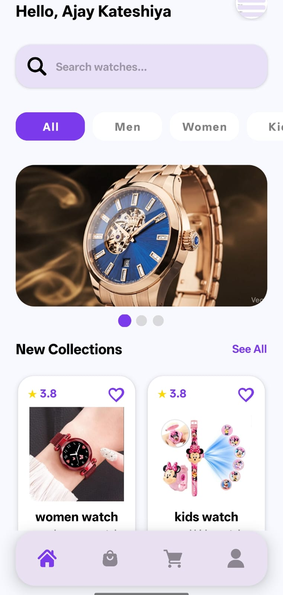
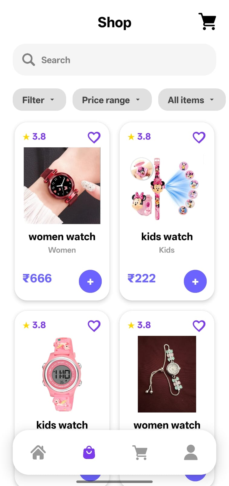
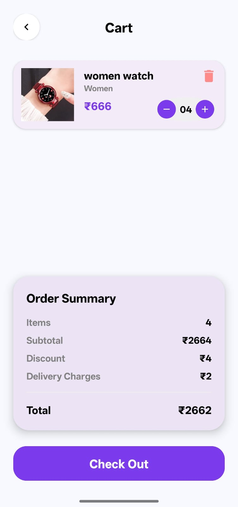
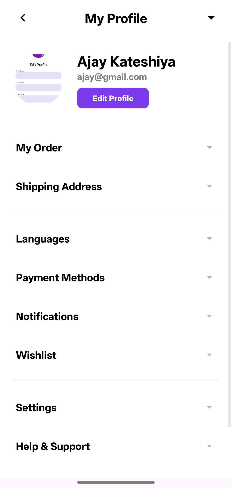

# Crown Watches

## Project Description
Crown Watches is an Android application built with Kotlin that allows users to browse and explore a collection of watches. The app provides a modern, intuitive interface for discovering watch products, viewing details, and managing purchases.

## Features
- 📱 **Modern Android UI** - Built with Material Design principles
- ⌚ **Watch Browsing** - Browse extensive watch catalog
- 🔍 **Product Search** - Find watches by name and specifications
- 💳 **Secure Payments** - Integrated Razorpay payment gateway
- 🔐 **User Authentication** - Google Login integration
- 📋 **Product Details** - View detailed watch information
- 🛒 **Shopping Cart** - Add watches to cart and manage orders
- 📱 **Responsive Design** - Optimized for various screen sizes

## Technologies Used
- **Language**: Kotlin
- **Platform**: Android
- **IDE**: Android Studio
- **Build System**: Gradle
- **Architecture**: MVVM (Model-View-ViewModel)
- **Database**: Firebase/Room
- **API Integration**: Razorpay (Payments), Google Login (Authentication)
- **UI Framework**: Android Jetpack, Material Design

## Project Structure
```
Crown-Watches/
├── app/                      # Main application module
│   ├── src/
│   │   ├── main/
│   │   │   ├── java/        # Kotlin/Java source code
│   │   │   ├── res/         # Resources (layouts, drawables, strings)
│   │   │   └── AndroidManifest.xml
│   │   └── test/
│   └── build.gradle.kts
├── gradle/                   # Gradle wrapper
├── build.gradle.kts          # Root build configuration
├── settings.gradle.kts       # Project structure configuration
├── gradle.properties         # Gradle properties
├── local.properties         # Local SDK configuration (not committed)
└── README.md                # This file
```

## Prerequisites
- Android Studio (latest version)
- Android SDK API level 24 or higher
- Kotlin 1.8+
- Gradle 7.0+
- Java Development Kit (JDK) 11 or higher

## Installation

### Clone the Repository
```bash
git clone https://github.com/kateshiyaajayh/Crown-Watches.git
cd Crown-Watches
```

### Setup Android Development Environment
1. Install Android Studio from [Android Developer Website](https://developer.android.com/studio)
2. Install the required SDK (API 24+)
3. Clone this repository
4. Open the project in Android Studio
5. Let Gradle sync dependencies automatically

### Configure Local Settings
- The `local.properties` file contains your SDK path and is automatically generated
- Do not commit this file to version control

## Building the Project

### Using Android Studio
1. Open the project in Android Studio
2. Wait for Gradle sync to complete
3. Click **Run** > **Run 'app'**
4. Select an emulator or connected device

### Using Command Line
```bash
# Build debug APK
./gradlew build

# Build and run on device/emulator
./gradlew installDebug
```

## Configuration

### API Keys & Sensitive Data
- Razorpay API keys should be configured in a secure configuration file
- Google Login credentials should be added via Firebase console
- Never commit sensitive data to version control

### Build Variants
- **Debug**: Development build with logging enabled
- **Release**: Production build optimized for size and performance

## Contributing
Contributions are welcome! Please follow these guidelines:
1. Create a feature branch from `main`
2. Make your changes with clear commit messages
3. Push to your fork and submit a pull request
4. Ensure all code follows Kotlin style guidelines

## License
This project is provided as-is for educational and academic purposes.

## Author
**Rohit Jograjiya**
**Ajay Kateshiya**
- GitHub: [@kateshiyaajayh](https://github.com/kateshiyaajayh)

  ## 📸 App Screenshots

### 🏠 Home Screen


---

### 🔐 Splash Screen


---

### 🛍️ Product Screen


---

### 🛒 Cart Screen



### 🛒 profile Screen


## Support & Questions
For questions or issues, please create an issue in the repository or contact the maintainer.

---

**Note**: This repository is prepared for academic submission and evaluation.
